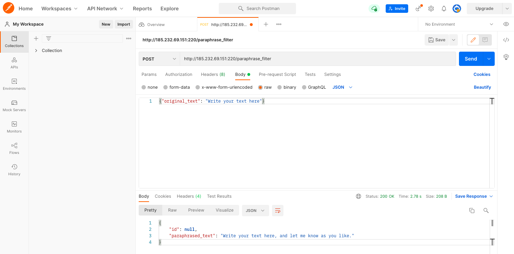

# API

This module contains paraphrasing API.

## How to run

Start the docker container using `docker-compose up`.

Alternatively, install all required dependencies form requirements.txt, then run the main script with python.

# How to make request to running API

You can request paraphrasing of source text using HTTP Post request to &{Server Address}/paraphrase_filter or &{Server Address}/paraphrase with data 
{ "original_text": "Your text." }. You will get response in the format { "paraphrased_text": "Paraphrased text." }.

The difference between paraphrase_filter and paraphrase API calls is that
paraphrase_filter will filter out paraphrases with low diversity, and 
paraphrase returns the paraphrase with the highest probability according to
language model and its inference mechanism.

As for 2021-11-30, the Server Adress for DynaGroup server is http://185.232.69.151:220, so
the link is then http://185.232.69.151:220/paraphrase_filter or http://185.232.69.151:220/paraphrase

As for 2021-11-30, to make a http request with Postman Client App to the server, you can use the following instructions:
1. Install Postman Client App from https://www.postman.com/product/rest-client and start the program
2. Register or sign in (probably)
3. Go to Workspaces, click on your Workspace (probably "My Workspace")
4. Click on plus sign
5. Replace "GET" HTTP method with "POST" method
6. Enter request URL "http://185.232.69.151:220/paraphrase_filter" or "http://185.232.69.151:220/paraphrase"
7. Click on body, choose "raw", and replace "Text" right from "raw" to "JSON" (we want to send in JSON format)
8. Write your text in the format {"original_text": "Write your text here"}
9. Click Send
10. You should see at the bottom the answer

You can find the picture with my screenshot in images.

## Structure

* inference.py - This script defines our paraphrasing model inference procedure.
* process_data.py - This script contains functions required for pre- and post-processing of data (splitting and joining)
* main.py - Main script that initializes API.

## Further improvement

* Make some comprehensive experiments with different inference parameters. The ideas include:
* You can add diversity penalty to the beam search to encourage model to produce more diverse sentences.
* You can restrict model for using some words from the input.
* You can use dissimilarity metrics with bert score to choose between multiple outputs. However, it will make
inference slower.
  
## Answers to some expected questions

Question: Why do you split the sentences?

Answer: Most samples in our datasets were single sentences, so the model works the best for single sentences. 

Question: Why do you use sentence_splitter for splitting, and not nltk or spacy?

Answer: We tried nltk and spacy, but they failed to recognize some common abbreviations such as M.Sc., esp. (especially).
In our case, it is not so bad if splitting does not split some sentences, but it is important that it does not
split the sentence in the middle, since we will get non-sense. 

sentence_splitter fitted here perfectly with predictive code (it is not trained model, it uses heuristics). 
Btw., you can use sentence_splitter with custom abbreviations list!
